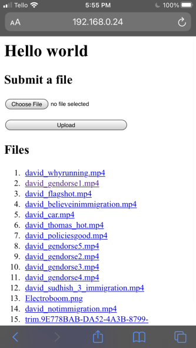

# FileTransfer

A small website I locally host on my network to exchange files from my phone and other devices to my laptop.



## Usage

Execute the following instructions.

```
python3 -m pip install flask # install prerequisites
gh repo clone r2dev2/FileTransfer # clone the repo
cd FileTransfer # go into the repo
python3 app.py
```

The resulting files will be in `__files__`.
